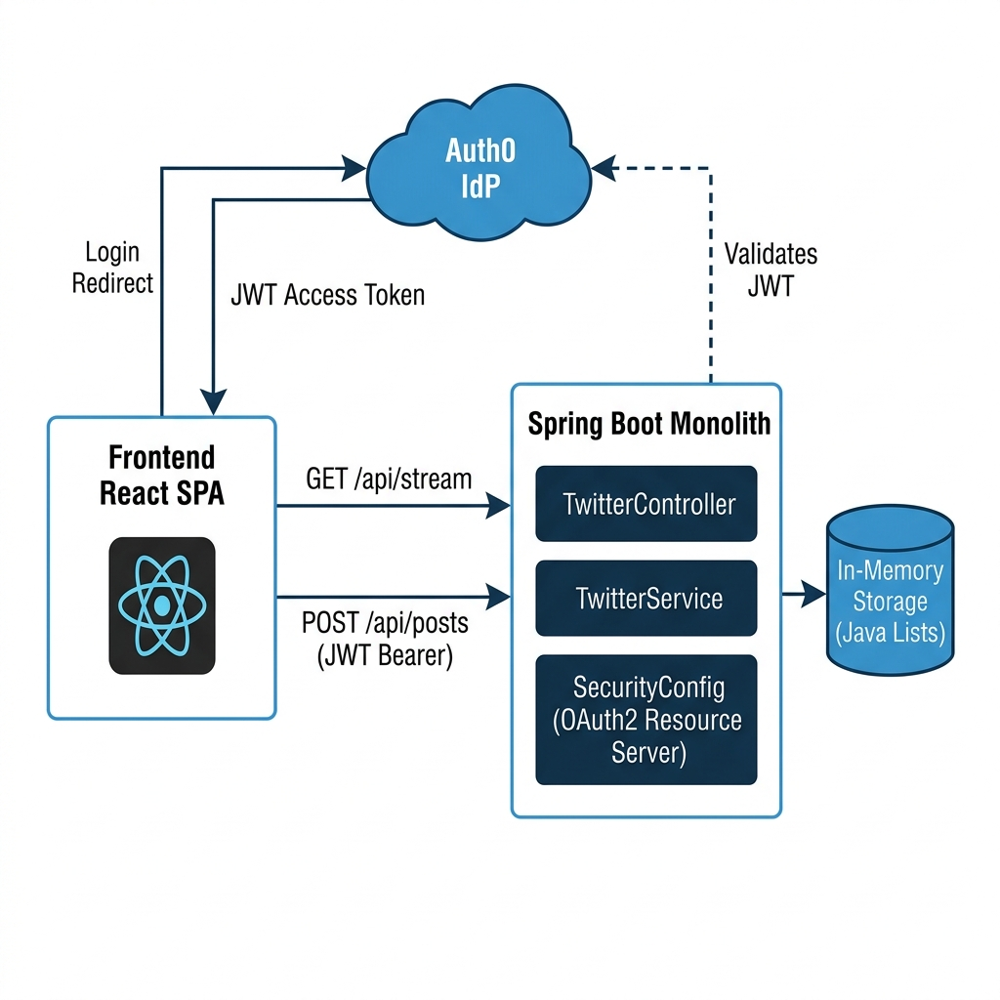
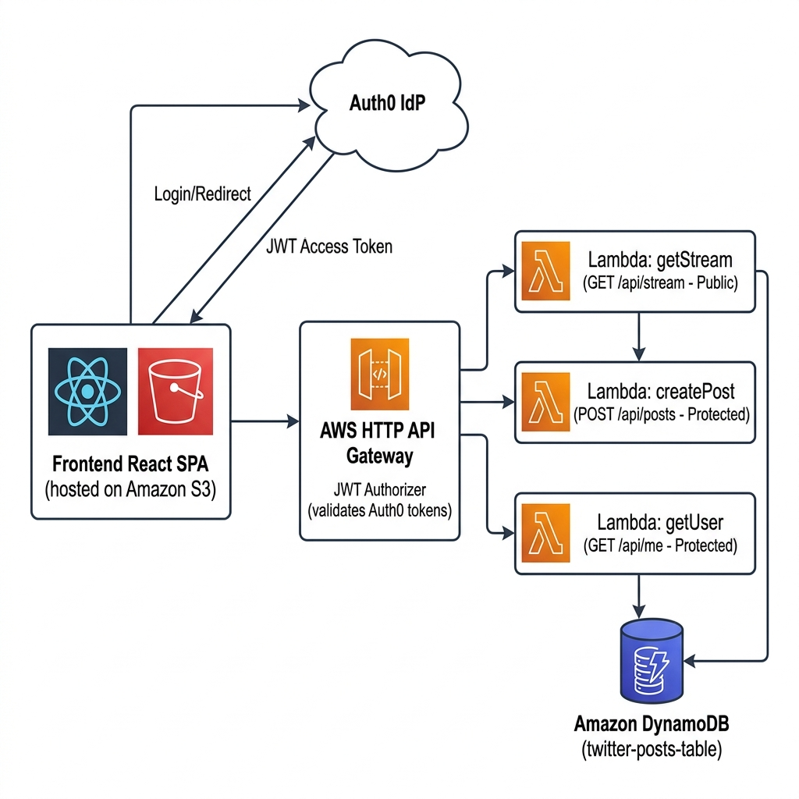
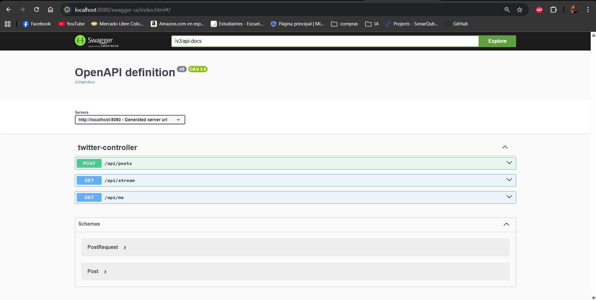
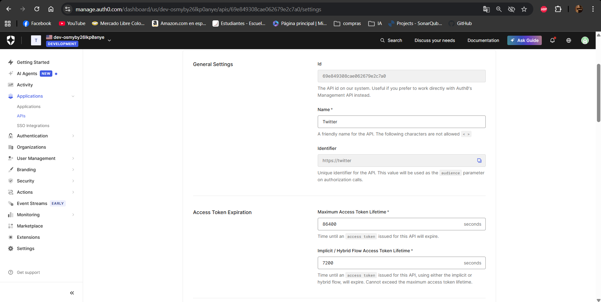
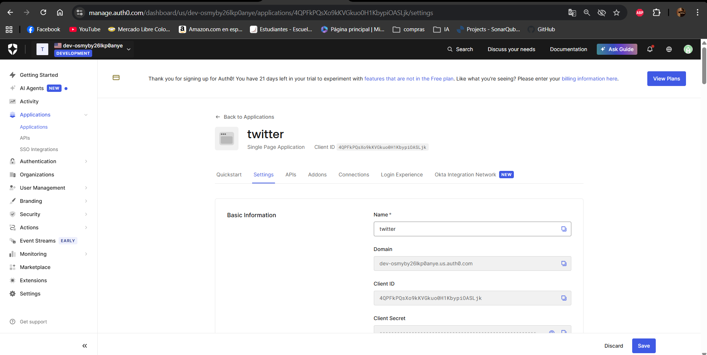
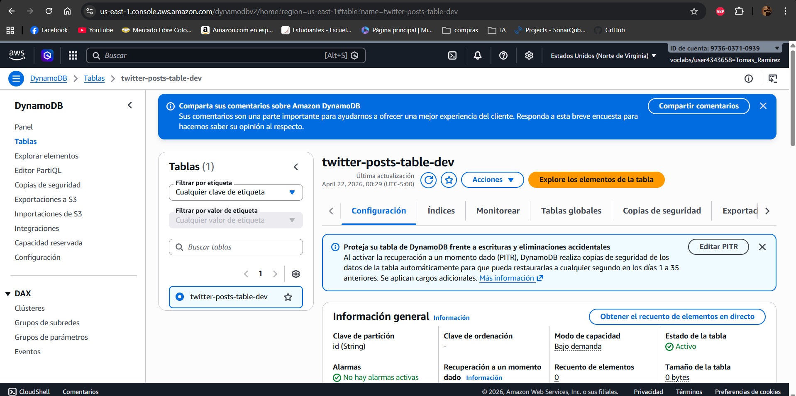
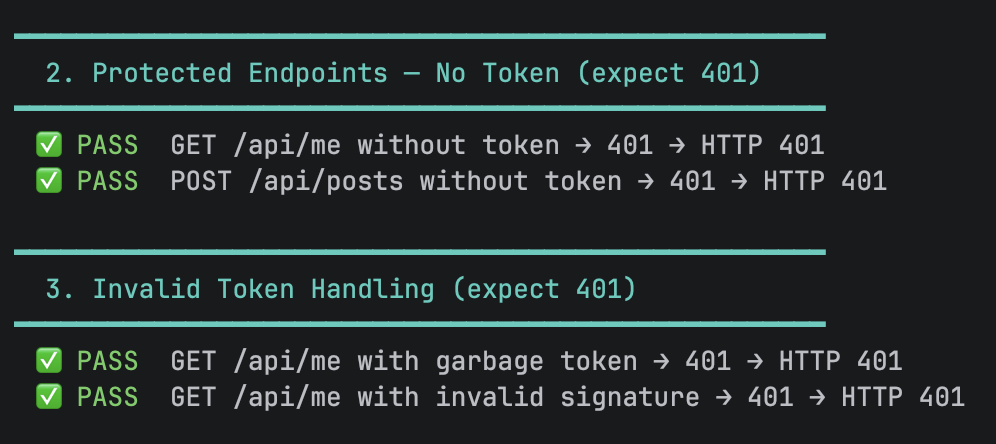
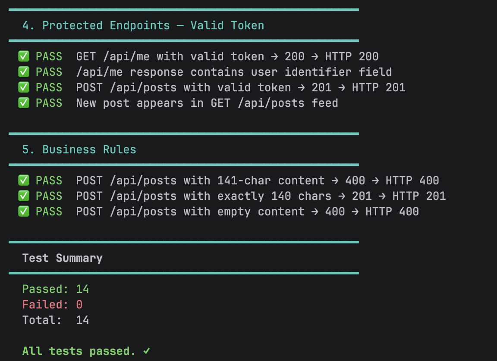

# Mini-Twitter: Secure Microservices on AWS with Auth0

**Integrantes:** Juan Pablo Contreras · Juan Carlos Leal · Tomas Ramirez

> Aplicación estilo Twitter donde usuarios autenticados publican posts de máximo 140 caracteres en un feed global. El proyecto evolucionó de un **Monolito Spring Boot** a **Microservicios 100% Serverless en AWS**, asegurado completamente con **Auth0**.

---

## Tabla de Contenido

1. [Descripción del Proyecto](#descripción-del-proyecto)
2. [Arquitectura](#arquitectura)
3. [API Design & Monolito](#api-design--monolito-spring-boot)
4. [Documentación Swagger / OpenAPI](#documentación-swagger--openapi)
5. [Frontend](#frontend-application)
6. [Seguridad con Auth0](#seguridad-con-auth0-mandatory)
7. [Migración a Microservicios](#migración-a-microservicios)
8. [Despliegue en AWS](#despliegue-en-aws)
9. [Instalación y Ejecución Local](#instalación-y-ejecución-local)
10. [Pruebas Realizadas](#pruebas-realizadas)
11. [Conclusiones](#conclusiones)
12. [Links](#links)

---

## Descripción del Proyecto

Esta aplicación implementa una red social simplificada donde:

- Los usuarios se autentican a través de **Auth0** (Google, GitHub, email).
- Pueden publicar posts de **máximo 140 caracteres** en un feed global único.
- El feed es **público** (cualquiera puede leerlo) pero **solo usuarios autenticados** pueden crear posts.
- El proyecto evolucionó de un **monolito** a **tres microservicios independientes** desplegados en **AWS Lambda**.

**Entidades principales:**

| Entidad | Descripción |
|--------|-------------|
| `User` | Usuario autenticado vía Auth0. Identificado por su `sub` (Auth0 ID). |
| `Post` | Publicación de hasta 140 caracteres. Incluye `authorId`, `content` y `timestamp`. |
| `Stream` | Feed global único de todos los posts ordenados cronológicamente. |

---

## Arquitectura

### Fase 1 — Monolito Spring Boot + Auth0

El monolito expone todos los endpoints desde una sola aplicación Spring Boot configurada como **OAuth2 Resource Server**, validando tokens JWT emitidos por Auth0.



### Fase 2 — Microservicios AWS Lambda + DynamoDB

El monolito fue refactorizado en tres microservicios independientes, cada uno desplegado como una función AWS Lambda con su propio endpoint en API Gateway.



**Stack tecnológico:**

| Capa | Tecnología |
|------|-----------|
| Frontend | React (Vite) + Auth0 React SDK |
| Autenticación | Auth0 (SPA Client + API Audience) |
| Backend (monolito) | Spring Boot 3 + Spring Security OAuth2 |
| Backend (microservicios) | AWS Lambda (Node.js) |
| API Gateway | AWS HTTP API Gateway con autorizador JWT nativo |
| Base de datos | Amazon DynamoDB |
| Hosting Frontend | Amazon S3 (Static Website) |
| IaC / Deploy | Serverless Framework |

---

## API Design & Monolito Spring Boot

### Diseño RESTful

La API sigue principios REST y define los siguientes endpoints:

| Método | Endpoint | Autenticación | Descripción |
|--------|----------|--------------|-------------|
| `GET` | `/api/stream` | Publica | Retorna todos los posts del feed global |
| `POST` | `/api/posts` | JWT requerido | Crea un nuevo post (máx 140 caracteres) |
| `GET` | `/api/me` | JWT requerido | Retorna información del usuario autenticado |

**Reglas de negocio:**
- El contenido de un post no puede exceder 140 caracteres (`400 Bad Request` si se supera).
- Solo usuarios con JWT válido (emitido por Auth0) pueden crear posts (`401 Unauthorized` si no hay token).
- El `authorId` se extrae automáticamente del claim `sub` del JWT.

### Estructura del Monolito (`/backend`)

```
backend/
├── src/main/java/edu/co/escuela/ing/MicroserviciosLambda/
│   ├── config/          # SecurityConfig (OAuth2 Resource Server), OpenApiConfig
│   ├── controller/      # PostController, StreamController, UserController
│   ├── model/           # Post, User, Stream (entities)
│   ├── repository/      # JPA Repositories
│   └── service/         # Business logic
└── src/main/resources/
    └── application.properties  # Auth0 issuer URI, audience
```

---

## Documentación Swagger / OpenAPI

El monolito Spring Boot incluye **Swagger UI** generado automáticamente con SpringDoc OpenAPI.

- **URL local:** `http://localhost:8080/swagger-ui/index.html`
- Todos los endpoints están documentados con modelos de request/response, parámetros y **requisitos de seguridad JWT Bearer token**.

### Evidencia Swagger UI



---

## Frontend Application

El frontend es una **Single Page Application (SPA)** desarrollada en **React + Vite** que consume la API backend.

### Funcionalidades

- **Login / Logout** con Auth0 (redirect flow)
- **Ver el feed global** de posts (público, sin autenticación)
- **Crear nuevos posts** (requiere estar autenticado)
- **Gestión automática de tokens** (silent refresh, token seguro en memoria)
- Muestra el nombre del usuario autenticado (`nickname` claim de Auth0)

### Despliegue en Amazon S3

El frontend está desplegado como sitio web estático en Amazon S3 y es públicamente accesible.

**URL:** [https://twitter-frontend-tomas-20260421.s3.amazonaws.com/index.html](https://twitter-frontend-tomas-20260421.s3.amazonaws.com/index.html)

### Evidencia de la Aplicación en Funcionamiento


---

## Seguridad con Auth0 (Mandatory)

### Configuración en Auth0

Se crearon dos entidades en Auth0:

| Entidad Auth0 | Tipo | Propósito |
|--------------|------|-----------|
| `Mini-Twitter SPA` | Single Page Application | Cliente del frontend React |
| `Mini-Twitter API` | API (Resource Server) | Audience del backend |

- **Audience:** `https://twitter`
- **Issuer URI:** `https://dev-osmyby26lkp0anye.us.auth0.com/`
- **Algoritmo:** RS256 (tokens firmados con clave privada Auth0)

### Evidencia de Configuración Auth0





### Flujo de Autenticación (Auth0 + JWT)

```
Usuario → Frontend (React) → Auth0 (Login)
                  ↓
            JWT Access Token (RS256)
                  ↓
         Backend / Lambda ← Valida JWT con Auth0 JWKS URI
```

### Protección de Endpoints

| Endpoint | Protección | Descripción |
|----------|-----------|-------------|
| `GET /api/stream` | Publico | Cualquier usuario puede leer el feed |
| `POST /api/posts` | JWT required | Solo usuarios autenticados crean posts |
| `GET /api/me` | JWT required | Retorna info del usuario autenticado |

**En el Monolito (Spring Boot):**
```java
// SecurityConfig.java
http.oauth2ResourceServer(oauth2 -> oauth2
    .jwt(jwt -> jwt.decoder(
        NimbusJwtDecoder.withJwkSetUri(
            "https://dev-osmyby26lkp0anye.us.auth0.com/.well-known/jwks.json"
        ).build()
    ))
);
```

**En los Microservicios (AWS Lambda + API Gateway):**

El **HTTP API Gateway** tiene configurado un autorizador JWT nativo que valida automáticamente el token antes de que la request llegue a la función Lambda:

```yaml
# serverless.yml
httpApi:
  authorizers:
    auth0Authorizer:
      type: jwt
      identitySource: $request.header.Authorization
      issuerUrl: https://dev-osmyby26lkp0anye.us.auth0.com/
      audience:
        - https://twitter
```

---

## Migración a Microservicios

### Los 3 Microservicios

| Microservicio | Handler Lambda | Responsabilidad |
|--------------|---------------|-----------------|
| **User Service** | `getUser` | `GET /api/me` — Retorna info del usuario autenticado desde el JWT |
| **Posts Service** | `createPost` | `POST /api/posts` — Crea un post, valida 140 chars, guarda en DynamoDB |
| **Stream Service** | `getStream` | `GET /api/stream` — Retorna todos los posts del feed global |

### Estructura de Microservicios (`/services`)

```
services/
├── serverless.yml           # IaC: Lambda + API Gateway + DynamoDB
├── package.json
└── src/
    ├── handlers/
    │   ├── getUser.js       # User Service Lambda
    │   ├── createPost.js    # Posts Service Lambda
    │   └── getStream.js     # Stream Service Lambda
    └── db/
        └── dynamodb.js      # DynamoDB client
```

### Base de Datos — Amazon DynamoDB

Se utiliza DynamoDB como base de datos NoSQL serverless.

- **Tabla:** `twitter-posts-table-dev`
- **Partition Key:** `postId` (UUID generado en Lambda)
- **Atributos:** `authorId`, `authorName`, `content`, `timestamp`



---

## Despliegue en AWS

### Proceso de Despliegue de Microservicios

El despliegue se realiza en un **solo comando** (`sls deploy`) desde la carpeta `services/`. El Serverless Framework aprovisiona automáticamente:

1. Tabla **DynamoDB** (`twitter-posts-table-dev`)
2. Tres funciones **Lambda** (`getStream`, `createPost`, `getUser`)
3. **HTTP API Gateway** con autorizador JWT de Auth0
4. **AWS Roles** con permisos mínimos por función

```bash
cd services
npm install
npx serverless deploy
```

### Despliegue del Frontend en S3

```bash
cd frontend
npm run build
aws s3 sync dist/ s3://twitter-frontend-tomas-20260421/ --delete
aws s3 website s3://twitter-frontend-tomas-20260421/ \
    --index-document index.html \
    --error-document index.html
```

---

## Instalación y Ejecución Local

### Requisitos Previos

- Node.js v18+
- Java 21 + Maven
- Cuenta AWS con credenciales configuradas (AWS Academy LabRole)
- Cuenta Auth0

### 1. Clonar el Repositorio

```bash
git clone https://github.com/App-TDSE/TDSE_Experimental_App.git
cd TDSE_Experimental_App
```

### 2. Configurar y Correr el Frontend

```bash
cd frontend
```

Crear el archivo `.env` en la carpeta `frontend/`:

```env
VITE_AUTH0_DOMAIN=dev-osmyby26lkp0anye.us.auth0.com
VITE_AUTH0_CLIENT_ID=4QPFkPQsXo9kKVGkuo0H1KbypiOASLjk
VITE_AUTH0_AUDIENCE=https://twitter
```

```bash
npm install
npm run dev        # Disponible en http://localhost:5173
```

### 3. Desplegar Microservicios en AWS

Configura tus credenciales de AWS Academy en `C:\Users\<usuario>\.aws\credentials`:

```ini
[default]
aws_access_key_id=TU_KEY
aws_secret_access_key=TU_SECRET
aws_session_token=TU_TOKEN
```

```bash
cd services
npm install
npx serverless deploy
```

Al finalizar, la terminal imprime la URL del API Gateway. Actualiza `API_URL` en `frontend/src/App.jsx` con esa URL.

### 4. Correr el Monolito (Opcional)

```bash
cd backend
mvn spring-boot:run
# Swagger UI disponible en: http://localhost:8080/swagger-ui/index.html
```

> **Nota:** El monolito requiere una base de datos PostgreSQL. Consulta `backend/src/main/resources/application.properties` para la configuración de conexión.

---

## Pruebas Realizadas

Se realizaron pruebas exhaustivas de todos los endpoints, verificando el correcto comportamiento de la seguridad Auth0.

### Resumen de Pruebas

| # | Prueba | Endpoint | Resultado Esperado | Resultado |
|---|--------|----------|--------------------|-----------|
| 1 | Feed público sin token | `GET /api/stream` | `200 OK` | Correcto |
| 2 | Crear post sin token | `POST /api/posts` | `401 Unauthorized` | Correcto |
| 3 | Info usuario sin token | `GET /api/me` | `401 Unauthorized` | Correcto |
| 4 | Post > 140 caracteres | `POST /api/posts` | `400 Bad Request` | Correcto |
| 5 | Login con Google via Auth0 | Auth0 flow | JWT válido, `authorId` en DynamoDB | Correcto |
| 6 | Crear post con JWT válido | `POST /api/posts` | `201 Created` | Correcto |
| 7 | Endpoint protegido con JWT | `GET /api/me` | `200 OK` con datos del usuario | Correcto |

### Evidencia de Pruebas — Endpoints Públicos


### Evidencia de Pruebas — Endpoints Protegidos (Test 1)



### Evidencia de Pruebas — Endpoints Protegidos (Test 2)



---

## Conclusiones

- **Arquitectura Serverless:** Elimina la administración de servidores y escala automáticamente ante la demanda, pagando solo por ejecución.
- **Auth0 como IdP:** Simplifica enormemente la autenticación y autorización, evitando implementar seguridad desde cero y garantizando cumplimiento de estándares OAuth2/OIDC.
- **DynamoDB:** Ofrece alta disponibilidad y rendimiento sin configuración de base de datos, ideal para workloads serverless.
- **Serverless Framework:** Un solo comando (`sls deploy`) aprovisiona toda la infraestructura en AWS (Lambda, API Gateway, DynamoDB, IAM), reduciendo drasticamente el tiempo de despliegue.
- **Evolución Monolito → Microservicios:** La separación de responsabilidades por servicio facilita el mantenimiento, el escalado independiente y la tolerancia a fallos.
- **Seguridad por capas:** La combinación de Auth0 (autenticación) + JWT (autorización) + API Gateway (validación de tokens) garantiza que ningún endpoint protegido sea accesible sin credenciales válidas.

---

## Links

- **App en AWS S3:** [https://twitter-frontend-tomas-20260421.s3.amazonaws.com/index.html](https://twitter-frontend-tomas-20260421.s3.amazonaws.com/index.html)
- **Video Demostracion:** [https://youtu.be/vR0v466-T7U](https://youtu.be/vR0v466-T7U)
- **Repositorio GitHub:** [https://github.com/App-TDSE/TDSE_Experimental_App](https://github.com/App-TDSE/TDSE_Experimental_App)

---

