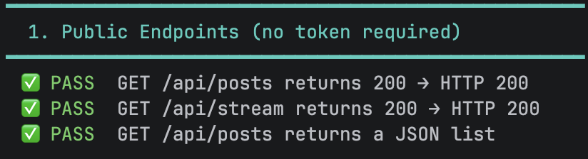

# **TDSE — Twitter-like Distributed Social Engine**
A simplified Twitter-like application where authenticated users can create short posts (max 140 characters) displayed in a single global public feed. Built as a Spring Boot monolith designed for future decomposition into AWS Lambda microservices, secured with Auth0.

**Created by**

Juan Pablo Contreras - Juan Carlos Leal - Tomas Ramirez

----
## **Setup Instructions**
### **Prerequisites**
In order to run this project you must have:
- Java 21, Maven 3.9+
- Docker + Docker Compose
- Node.js 20+
- Auth0 account with a SPA application and an API configured with audience `https://tdseapp.api`
### **Backend**
```bash
git clone https://github.com/App-TDSE/TDSE_Experimental_App
cd TDSE_Experimental_App/backend
 
cp .env.example .env
# Fill in AUTH0_DOMAIN, AUTH0_AUDIENCE, DB credentials
 
docker compose up -d --build
./mvnw spring-boot:run
```
Backend runs at `http://localhost:8080`.
### **Frontend**
```bash
cd TDSE_Experimental_App/frontend
 
npm install
 
cp .env.example .env
# Fill in VITE_AUTH0_DOMAIN, VITE_AUTH0_CLIENT_ID, VITE_AUTH0_AUDIENCE
 
npm run dev
```
Frontend runs at `http://localhost:5173`.

----

## **Architecture Overview - Monolith**
The system is a single Spring Boot application deployed as one unit. It exposes a REST API backed by PostgreSQL, secured entirely through Auth0 JWT validation. The React frontend communicates with the API over HTTP, obtaining access tokens from Auth0 before calling any protected endpoint. Auth0 handles all authentication, the backend never sees a password, it only validates tokens.

Modules inside the monolith communicate directly through Spring's dependency injection context. There is no internal HTTP; this makes future extraction into independent Lambda functions straightforward since each module already owns its own repository and service layer.

## **Monolith Modules**
### **User / Auth Module**

Bridges Auth0 identity with the application's own user records. When a JWT first arrives from a new Auth0 user, `UserService.getOrCreateFromJwt()` provisions that user in the local database using the `sub` claim as the unique identifier. Auth0 owns the login flow entirely.

| File | Purpose |
|------|---------|
| `SecurityConfig.java` | Configures Spring as an OAuth2 Resource Server: JWKS validation, audience checking, authority mapping from `scope` and `permissions` claims, and 401/403 error handlers. |
| `AudienceValidator.java` | Rejects tokens whose `aud` claim does not match the configured API audience. |
| `UserService.java` | `getOrCreateFromJwt(jwt)` — upserts a user on first token arrival; returns the existing record on subsequent calls. |
| `UserController.java` | `GET /api/me` — returns the authenticated user's profile. Protected by `@PreAuthorize`. |
| `UserEntity.java` | JPA entity for the `users` table. Uses explicit `@Column(name = "...")` on all fields to prevent Hibernate naming mismatches. |
| `OpenApiConfig.java` | Registers the Bearer JWT security scheme in Swagger UI. |
| `V1__init_schema.sql` | Flyway migration creating the `users` table (`id`, `auth0_sub`, `email`, `username`, `created_at`). |

### **Posts Module**
Handles creation and retrieval of posts. A post belongs to an authenticated user and enforces the 140-character limit at the service layer.

| File | Purpose |
|------|---------|
| `PostEntity.java` | JPA entity for the `posts` table (`id`, `content`, `author` FK → users, `created_at`). |
| `PostRepository.java` | Spring Data JPA repository with pagination support. |
| `PostService.java` | Validates content length and associates the post with the authenticated user via JWT `sub`. |
| `PostController.java` | `GET /api/posts` (public, paginated). `POST /api/posts` (protected, requires `write:posts`). |

### **Stream**
The stream is served by `StreamController`, which queries posts ordered by `created_at DESC` and returns them as the global public feed. It uses the same `PostRepository` as the Posts module — there is no separate data layer. `GET /api/stream` is public and requires no token.
> **Why keep it separate from `GET /api/posts`?** In the microservices phase, the Stream Service becomes its own Lambda with an independent scaling profile. Having a dedicated endpoint now makes that extraction clean without any API contract changes. The spec also lists it as a required endpoint.

## **Security Architecture (Auth0)**
Auth0 is the sole Identity Provider. The backend never issues tokens, it only validates them. Every protected request goes through the same chain: extract Bearer token -> fetch public key from Auth0's JWKS endpoint -> validate RS256 signature -> validate audience and expiry -> map claims to Spring authorities.
### **Auth0 Configuration**
| Setting | Value |
|---------|-------|
| Tenant | `dev-wbpt56q04xs2migc.us.auth0.com` |
| SPA Application | `TDSE_App_Posts` (Client ID in `.env`) |
| API Audience | `https://tdseapp.api` |
| Token Algorithm | RS256 |
| JWKS endpoint | `https://{tenant}/.well-known/jwks.json` |

### **Endpoint Access Matrix**
| Endpoint | Method | Auth Required | Required Scope |
|----------|--------|------|----------------|
| `/api/posts` | GET | No | — |
| `/api/stream` | GET | No | — |
| `/api/posts` | POST | Yes | `write:posts` |
| `/api/me` | GET | Yes | `read:profile` |

### Scopes
| Scope | Meaning |
|-------|---------|
| `read:posts` | Read posts and stream |
| `write:posts` | Create new posts |
| `read:profile` | Access own user profile |

## **Frontend Overview**
Built with React + Vite using `@auth0/auth0-react`. The SDK handles token lifecycle, silent refresh, and in-memory storage, meaning that the app never manually manages the access token.

| File | Purpose |
|------|---------|
| `main.jsx` | Wraps the app in `Auth0Provider` with `domain`, `clientId`, `audience`, and `scope` |
| `App.jsx` | Login/logout, user profile display, post creation, global feed |
| `.env.example` | Documents required environment variables |

### **Required .env Variables**
```env
VITE_AUTH0_DOMAIN=your-tenant.us.auth0.com
VITE_AUTH0_CLIENT_ID=your-spa-client-id
VITE_AUTH0_AUDIENCE=https://yourapi.api
VITE_API_URL=http://localhost:8080
```

### **Auth0 SPA settings required:**
| Setting | Value |
|---------|-------|
| Allowed Callback URLs | `http://localhost:5173` (dev), your S3/CloudFront URL (prod) |
| Allowed Logout URLs | same as above |
| Allowed Web Origins | same as above |

## **API Reference**
- Swagger UI: `http://localhost:8080/swagger-ui.html`  
- OpenAPI spec: `http://localhost:8080/v3/api-docs`

To test protected endpoints: click Authorize in Swagger UI and paste a valid JWT from Auth0 Dashboard -> APIs -> Test tab.

## **Test Report**
A shell script is provided at `tests/test_api.sh` that runs the full test suite automatically — no manual curl commands needed. It checks public endpoints, JWT validation, protected endpoint access, and the 140-character business rule. If Auth0 M2M credentials are configured, it also fetches a real token and runs the authenticated tests end-to-end.

### **Running the tests**
To run the test you must start the application, so you must follow the indications given in the Setup Instructions section.
#### **Option A - With automated token acquisition (recommended)**
Create an M2M application in Auth0 Dashboard (Applications -> Create -> Machine to Machine), authorize it against your API, then:
```bash
cd tests
cp .env.test.example .env.test
# Fill in AUTH0_DOMAIN, AUTH0_CLIENT_ID, AUTH0_CLIENT_SECRET, AUTH0_AUDIENCE
chmod +x test_api.sh
./test_api.sh
```

#### **Option B - With a manually provided token**
Grab a token from Auth0 Dashboard -> APIs -> your API -> Test tab, then:
```bash
./test_api.sh --token eyJhbGci...
```

#### **Option C - Public tests only**
Run the script with no configuration at all. Tests 1–3 (public endpoints and invalid token handling) run without any Auth0 credentials. Tests 4–5 are skipped and reported as such.
```bash
./test_api.sh
```

### **What the script tests**
#### **1. Public Endpoints**
| Test | Expected |
|------|----------|
| `GET /api/posts` — no token | 200 OK, JSON list |
| `GET /api/stream` — no token | 200 OK |

#### **2. Protected Endpoints - No Token**
| Test | Expected |
|------|----------|
| `GET /api/me` — no token | 401 Unauthorized |
| `POST /api/posts` — no token | 401 Unauthorized |

#### **3. Invalid Token Handling**
| Test | Expected |
|------|----------|
| Random garbage string as Bearer token | 401 Unauthorized |
| Structurally valid JWT with bad signature | 401 Unauthorized — proves the backend validates signatures, not just structure |

#### **4. Protected Endpoints - Valid Token (requires Auth0 credentials)**
| Test | Expected |
|------|----------|
| `GET /api/me` — valid token | 200 OK, user JSON with `id` field |
| `POST /api/posts` — valid token | 201 Created, post appears in feed |

#### **5. Business Rules - 140-character limit (requires Auth0 credentials)**
| Test | Expected |
|------|----------|
| Post with 141 characters | 400 Bad Request |
| Post with exactly 140 characters | 201 Created — confirms the boundary is inclusive |
| Post with empty content | 400 Bad Request |

### **Obtained Results**


